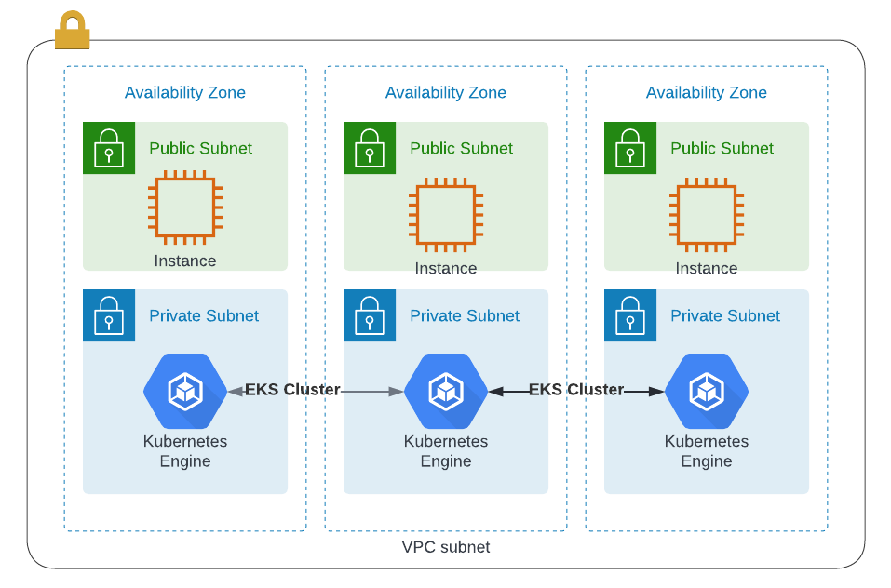

# consul-aws-eks-terraform

This simple guide will give you the ability to spin up a AWS Kubernetes Cluster with a basion server and consul.

## Prerequisites
The tutorial assumes some basic familiarity with Kubernetes and kubectl but does not assume any pre-existing deployment.

It also assumes that you are familiar with the usual Terraform plan/apply workflow. If you're new to Terraform itself, refer first to the Getting Started tutorial.

For this, you will need:

* an AWS account with the IAM permissions listed on the EKS module documentation,
* configured AWS CLI
* AWS IAM Authenticator
* kubectl installed

### Mac Installer 

Use the package manager homebrew to install the AWS CLI.

```
brew install awscli
```

After you've installed the AWS CLI, configure it by running aws configure.

When prompted, enter your AWS Access Key ID, Secret Access Key, region and output format.

```
aws configure
AWS Access Key ID [None]: YOUR_AWS_ACCESS_KEY_ID
AWS Secret Access Key [None]: YOUR_AWS_SECRET_ACCESS_KEY
Default region name [None]: us-east-2
Default output format [None]: json
```

Your default region can be found in the AWS Web Management Console beside your username. Select the region drop down to find the region name (eg. us-east-1) corresponding with your location.

## Set up and initialize your Terraform workspace

In your terminal, clone the following repository. It contains the example configuration used in this tutorial.

```
git clone https://github.com/maniak-academy/consul-aws-eks-terraform
```

You can explore this repository by changing directories or navigating in your UI.

```
cd consul-aws-eks-terraform
```

In here, you will find six files used to provision a VPC, security groups, bastion server and an EKS cluster. The final product should be similar to this:



